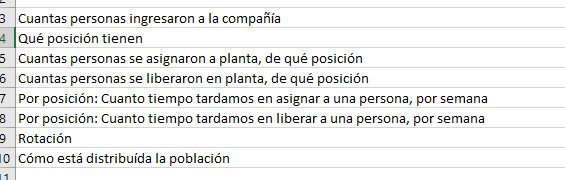
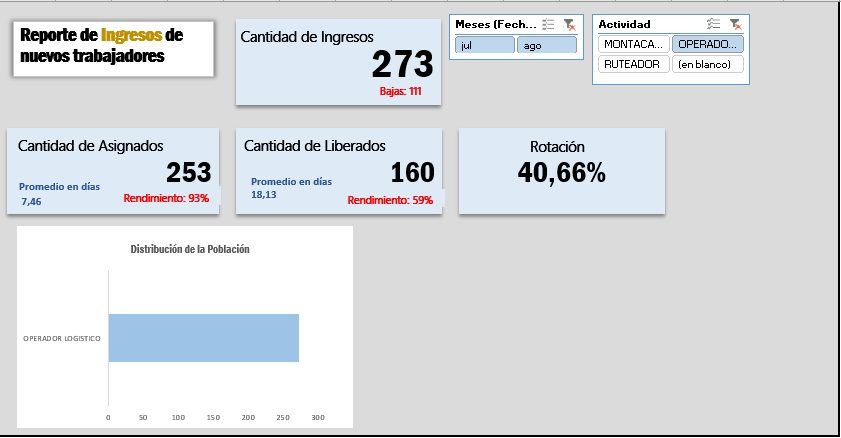

# Evaluación Técnica Excel

Una práctica de Excel con BD ficticia con ingresos de personal de un período de tiempo de una empresa.

# Targets

* Análisis para responder las preguntas de la evaluación.
* Uso de tablas dinámicas y gráficos.
* Muestra de Ingresos, Bajas, Cantidad Asignados, Cantidad Liberados y Rotación de personal.
* Uso de segmentadores de Mes y Actividad.
* Creación de dashboard.

## Screenshot

